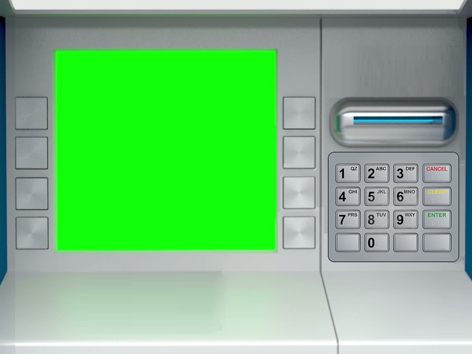

# TDD + Caixa Eletrônico

## Tecnologias/Ferramentas usadas

- Spring Boot
- Gradle
- Mustache (linguagem de template)
- Flyway
- Spring Data
- Hibernate
- H2
- Tomcat
- Java 8

## Como executar

Na pasta raiz do projeto (a pasta onde está o `build.gradle`), use:

    gradlew bootRun
    
Para rodar, requer apenas o Java 8. Caso não tenha o Gradle instalado, um será baixado automaticamente.

  
    
### Suporte Gradle no IntelliJ
- O plugin 'idea' nao presta, pois soh cria _file-based_, nao _directory-based_.
- Quando voce dah open->import as gradle, ele nao pega direito os `build` dirs, e um make do intellij (<kbd>ctrl+f9</kbd>)
cria um diretorio `out` bizonho na raiz
    - Quando eu dei open sem nada e ele, quando abriu, ofereceu pra importar como gradle, funcionou
     tudo (os filhos gerando tudo na pasta `build`, independentemente de eu ter usado via Intellij ou via gradle direto)
    - Preciso confirmar pra saber se eh repetitivel